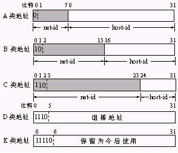
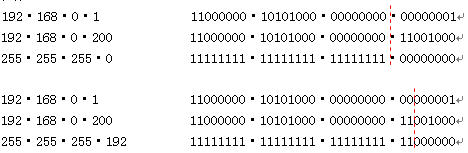
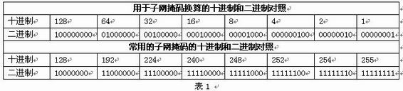

本文介绍的都是版本4的IP地址(IPv4)。  

### IP地址介绍
IP地址（Internet Protocol Address）是指互联网协议地址（又译为网际协议地址），是IP Address的缩写。IP地址是IP协议提供的一种统一的地址格式，它为互联网上的每一个网络和每一台主机分配一个逻辑地址，以此来屏蔽物理地址的差异。  

IP地址的长度为32位(共有2^32个IP地址)，分为4段，每段8位，用十进制数字表示，每段数字范围为0～255，段与段之间用句点隔开（例如：61.135.169.125）。  

### IP地址分类
IP地址可以视为网络号和主机号两部分，因此IP地址可分两部分组成，一部分为网络地址，另一部分为主机地址。IP地址分为A、B、C、D、E5类，它们适用的类型分别为：大型网络、中型网络、小型网络、多目地址、备用。常用的是B和C两类。

下图是IP地址分类方式：  
  

A类地址：A类地址的网络标识由第一组8位二进制数表示， A类地址的特点是网络标识的第一位二进制数取值必须为0。不难算出，A类地址第一个地址为00000001，最后一个地址是01111111，换算成十进制就是127，其中127留作保留地址，A类地址的第一段范围是：1～126，A类地址允许有2^7-2=126个网段（减2是因为0不用，127留作它用），网络中的主机标识占3组8位二进制数，每个网络允许有2^24-2=16777216台主机（减2是因为全0地址为网络地址，全1为广播地址，这两个地址一般不分配给主机）。通常分配给拥有大量主机的网络。  
B类地址：B类地址的网络标识由前两组8位二进制数表示，网络中的主机标识占两组8位二进制数，B类地址的特点是网络标识的前两位二进制数取值必须为10。 B类地址第一个地址为10000000，最后一个地址是10111111，换算成十进制B类地址第一段范围就是128～191，B类地址允许有214 =16384个网段，网络中的主机标识占2组8位二进制数，每个网络允许有216-2=65533台主机，适用于结点比较多的网络。  
C类地址：C类地址的网络标识由前3组8位二进制数表示，网络中主机标识占1组8位二进制数C类地址的特点是网络标识的前3位二进制数取值必须为110。C类地址第一个地址为11000000，最后一个地址是11011111，换算成十进制C类地址第一段范围就是192～223，C类地址允许有221 =2097152个网段，网络中的主机标识占1组8位二进制数，每个网络允许有28-2= 254台主机，适用于结点比较少的网络。

IP地址分类网络号区间如下：  

| TYPE |   最大网络数    |IP地址范围                  | 单个网段最大主机数 | 私有IP地址范围               |
|:----:|:-------------:|:--------------------------:|:---------------:|:-------------------------:|
|A     | 126（2^7-2)   | 0.0.0.0-127.255.255.255    |16777214       | 10.0.0.0-10.255.255.255    |
|B     | 16384(2^14)   | 128.0.0.0-191.255.255.255  |65534          | 172.16.0.0-172.31.255.255  |
|C     | 2097152(2^21) | 192.0.0.0-223.255.255.255	|254            | 192.168.0.0-192.168.255.255|

### 特殊IP地址
1. 私有地址  
上面提到IP地址在全世界范围内唯一，但是像192.168.0.1这样的地址在许多地方都能看到，并不唯一，这是为何？Internet管理委员会规定如下地址段为私有地址，私有地址可以自己组网时用，但不能在Internet上用，Internet上没有这些地址的路由，有这些地址的计算机要上网必须转换成为合法的IP地址,也称为公网地址，这就像有很到的世界公园，每个公园内都可命名相同的大街，如香榭丽舍大街，但对外我们只能看到公园的地址和真正的香榭丽舍大街。下面是A、B、C类网络中的私有地址段。自己组网时就可以用这些地址了。  
A类：10.0.0.0～10.255.255.255  
B类：172.16.0.0～172.131.255.255  
C类：192.168.0.0～192.168.255.255  
2. 回送地址  
A类网络地址127是一个保留地址，用于网络软件测试以及本地机进程间通信，叫做回送地址（loopback address）。无论什么程序，一旦使用回送地址发送数据，协议软件立即返回之，不进行任何网络传输。含网络号127的分组不能出现在任何网络上。  
小技巧：  
Ping 127.0.0.1,如果反馈信息失败,说明IP协议栈有错,必须重新安装TCP/IP协议。如果成功,ping本机IP地址,如果反馈信息失败,说明你的网卡不能和IP协议栈进行通信。  
如果网卡没接网线，用本机的一些服务如MySQL、IIS等就可以用127.0.0.1这个地址。  
3. 广播地址  
TCP/IP规定，主机号全为1的网络地址用于广播之用，叫做广播地址。所谓广播，指同时向同一子网所有主机发送报文。  
4. 网络地址  
TCP/IP协议规定，各位全为0的网络号被解释成本网络。  
由上可以看出：一、含网络号127的分组不能出现在任何网络上；二、主机和网关不能为该地址广播任何寻径信息。  
由以上规定可以看出，主机号全0全1的地址在TCP/IP协议中有特殊含义，一般不能用作一台主机的有效地址。  

### IP子网掩码
子网掩码的作用就是和IP地址与运算后得出网络地址，子网掩码也是32bit，并且是一串1后跟随一串0组成，其中1表示在IP地址中的网络号对应的位数，而0表示在IP地址中主机对应的位数。  
1）标准子网掩码  
A类网络（1 - 126），缺省子网掩码：255.0.0.0 ， 换算成二进制为：11111111·00000000·00000000·00000000  
可以清楚地看出前8位是网络地址，后24位是主机地址，也就是说，如果用的是标准子网掩码，看第一段地址即可看出是不是同一网络的。如21.0.0.0.1和21.240.230.1，第一段为21属于A类，如果用的是默认的子网掩码，那这两个地址就是一个网段的。  
B类网络（128 - 191） 缺省子网掩码：255·255·0·0  
C类网络（192 - 223） 缺省子网掩码：255·255·255·0  

2）特殊的子网掩码   
标准子网掩码出现的都是255和0的组合，在实际的应用中还有下面的子网掩码  
> 255·128·0·0  
> 255·192·0·0  

> 255·255·192·0  
> 255·255·240·0  

> 255·255·255·248  
> 255·255·255·252  

这些子网掩码又是什么意思呢？这些子网掩码的出现是为了把一个网络划分成多个网络。  
如下所示：192·168·0·1和192·168·0·200如果是默认掩码255.255.255.0两个地址就是一个网络的，如果掩码变为255.255.255.192这样各地址就不属于一个网络了。如下图所示：
  

3）子网掩码对照表  
  
