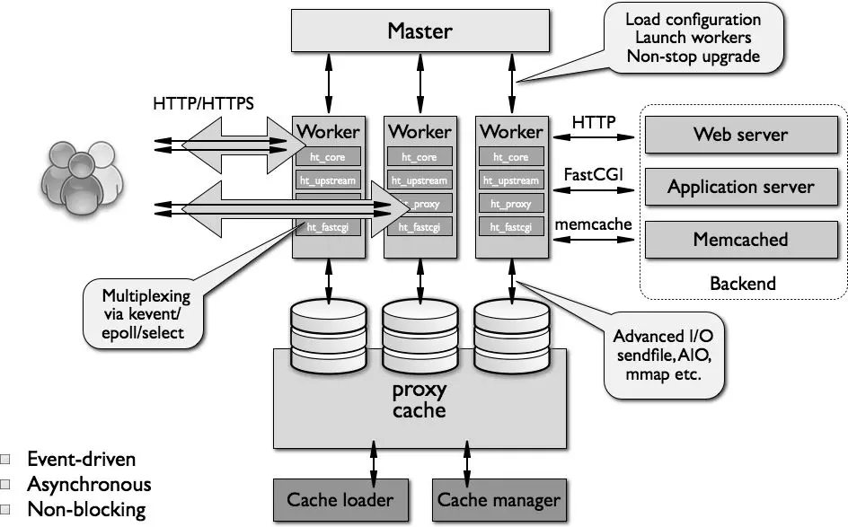

## Nginx架构及工作流程

上图是Nginx的架构，这个架构类似于Apache的Worker工作状态，Nginx的每一个Worker进程都管理着大量的线程，真正处理请求的是Worker之下的线程。

所有实际上的业务处理逻辑都在worker进程。worker进程中有一个函数，执行无限循环，不断处理收到的来自客户端的请求，并进行处理，直到整个nginx服务被停止。Worker中这个函数执行内容如下：

* 操作系统提供的机制（例如epoll, kqueue等）产生相关的事件。  
* 接收和处理这些事件，如是接受到数据，则产生更高层的request对象。  
* 处理request的header和body。  
* 产生响应，并发送回客户端。
* 完成request的处理。
* 重新初始化定时器及其他事件。
