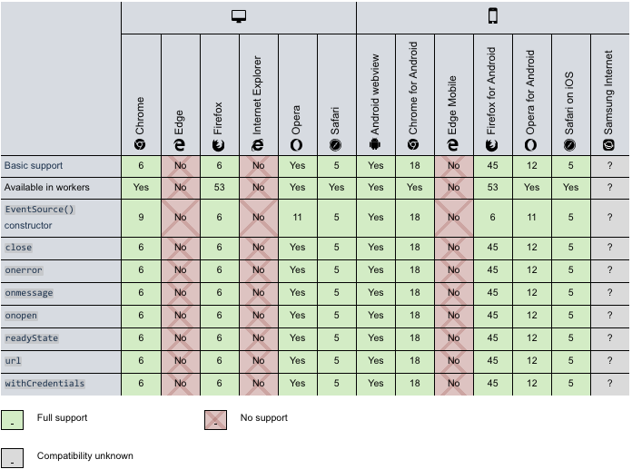

## 概述（Overview）
服务器发送事件（SSE）是一种使客户端能够通过HTTP连接从服务器接收自动更新的技术。  

逻辑上，HTTP协议无法做到服务器主动推送数据。但是，有一种变通方式，就是服务器向客户端声明接下来发送的是连续数据流（Event Stream）。

也就是说，发送的不是一次性的数据包，而是一个数据流，会连续不断地发送过来。这时，客户端不会关闭连接，会一直等着服务器发过来的新的数据流，视频播放就是这样的例子。本质上，这种通信就是以流信息的方式，完成一次用时很长的下载。

与WebSockets不同，服务器发送的事件是单向的; 也就是说，数据消息是从一个方向传递的，从服务器传送到客户端（例如用户的Web浏览器）。 当没有必要以消息形式从客户端向服务器发送数据时，这使它们成为一个很好的选择。 例如，EventSource是处理社交媒体状态更新，新闻源或将数据传递到客户端存储机制（如IndexedDB或Web存储）之类的有用方法。

## 处理时序（Processing Timeline）

1.客户端（Client）向服务端发起一个普通的HTTP请求；  
2.服务端反馈客户端，响应内容是文本事件流，采用分块编码方式并会持续的发送。这里会设置MIME类型为 “text/event-stream” ，设置Transfer-Encoding为 “chunked”；  
3.服务端有新的数据产生，会持续的向客户端推送数据；  
4.客户端关闭HTTP请求；

## SSE的特点
Being only a subscribe channel it has the limitation of not being able to publish data, but that can be done through a regular XHR request.

In a nutshell, SSE can be seen as an extension of AJAX, since it is working on top of XMLHttpRequest. It can be used primarily for receiving data from the server real-time in a more elegant and much simplified manner than long-polling.


## 客户端实现
这里客户端实现我们采用 EventSource 方式。

EventSource 是 Server-Sent Events API 的客户端实现已作为HTML5的一部分，由W3C标准化。

"EventSource"实例打开到HTTP服务的长链接（Persistent Connection），HTTP服务已文本事件流格式（text/event-stream format）发送事件。期间连接保持打开状态，直到通过调用EventSource.close()关闭为止。

#### JS实现示例
```javascript
<body>
<script>
var source = new EventSource('http://127.0.0.1:8080/stream');
source.onopen = function (event) {
  console.log("open > Connection open ...");
};
source.onerror = function (event) {
  console.log("error > Connection error.");
};
source.onmessage = function (event) {
  console.log("message > " + event.data);
};
source.addEventListener('warn', function (event) {
  console.log("warn > " + event.data);
}, false);
</script>
</body>
```
#### EventSource 详情
EventSource API Doc 参见 [MDN EventSource API](https://developer.mozilla.org/en-US/docs/Web/API/EventSource)

##### EventSource 构造函数
*new EventSource(url[, {withCredentials:true}])*  
创建一个 EventSource 实例用于接收并处理来至URL指定服务的事件流。


##### EventSource 属性
###### EventSource.readyState `<只读>`  可选值：CONNECTING (0), OPEN (1), or CLOSED (2)

###### EventSource.url `<只读>`  表示事件源的URL

###### EventSource.withCredentials `<只读>`  该值由构造函数指定 CORS credentials set，默认值为 false


##### EventSource 事件句柄（Event handlers）
Event Source Handlers包含3个，当对应的事件发生时会被调用。

###### EventSource.onopen 当收到open事件时会被调用，即connection被打开时。

###### EventSource.onerror 当error发生时会被调用，比如连接中断、网络异常等。

###### EventSource.onmessage 当从服务端收到消息时会被调用。

##### EventSource 方法（Methods）
EventSource同样集成了来至其父类（[EventTarget](https://developer.mozilla.org/en-US/docs/Web/API/EventTarget)）的方法。常用的方法如下：
###### EventSource.close() 关闭连接，并将readyState设置为“CLOSED”。
###### EventSource.addEventListener(type, listener[, useCapture]) 添加指定类型的事件，listener指定的方法会被调用。type可以是EventSource内置的(open/error/message)事件，也可以是用户自定义事件（比如：warn）。


## 服务端实现
SSE规范要求响应必须为文本事件流。文本事件流是一个简单的文本数据流，使用UTF-8进行编码。

下面是一个SSE HTTP响应示例：  
```
HTTP/1.1 200 OK
Content-Type: text/event-stream
Cache-Control: no-cache
Connection: keep-alive
Access-Control-Allow-Origin: *
Transfer-Encoding: chunked

id: 1001
data: This is the first message.

event: notification
data: This is the second message, it has
data: two line.
```
### 文本事件流格式（Event Stream Format）
事件流MIME格式必须为 “text/event-stream” 类型。

响应体行与行直接必须采用CRLF（回车换行）字符对，单个CR（回车）或LF（换行）进行分割。

内容行格式为 `[filed]: [value]`

filed 可以取4个值，data/event/id/retry

#### data 字段
data字段用于表示流事件数据内容
#### event 字段
event字段用于表示流事件名称
#### id 字段
id字段用于表示流事件编号
#### retry 字段
retry字段用于指定客户端重新发起连接的时间间隔

### 将ID与事件关联
我们可以采用如下方式为流事件附上ID
```
id: 201900007\n
data: Hi, \n
data: Lily\n\n
```
设置ID可让客户端（比如：Chrome/Firefox）跟踪最后触发的事件，以便在断开连接后，在新请求中设置特殊的HTTP标头（Last-Event-ID）。

### 控制超时重连间隔
大部分浏览器客户端在连接断开时会每隔3秒尝试重连。其实我们可以通过 “retry:” 方式设置重试间隔的毫秒数。示例如下：
```
retry: 5000\n
id: 201900007\n
data: Hi, \n
data: Lily\n\n
```

### NodeJS实现示例
```javascript
var http = require("http");

http.createServer(function (req, res) {
  if (req.url == "/stream") {
    res.writeHead(200, {
      "Content-Type":"text/event-stream",
      "Cache-Control":"no-cache",
      "Connection":"keep-alive",
      "Access-Control-Allow-Origin": '*'
    });
    res.write("retry: 10000\n\n");

    dataing = setInterval(function () {
      res.write("data: " + (new Date()) + "\n\n");
    }, 2000);

    warning = setInterval(function () {
      res.write("event: " + "warn" + "\n");
      res.write("data: " + "alarm warning" + "\n\n");
    }, 2000);

    req.connection.addListener("close", function () {
      clearInterval(dataing);
      clearInterval(warning)
    }, false);
  }
}).listen(8080, "127.0.0.1");
```


## SSE请求响应示例
```
GET /stream HTTP/1.1
Host: 127.0.0.1:8080
Connection: keep-alive
```

```
HTTP/1.1 200 OK
Content-Type: text/event-stream
Cache-Control: no-cache
Connection: keep-alive
Access-Control-Allow-Origin: *
Transfer-Encoding: chunked

id: 1001
data: This is the first message.

event: notification
data: This is the second message, it has
data: two line.

```

## 浏览器兼容性（Browser Compatibility）


## Reference
https://en.wikipedia.org/wiki/Server-sent_events  
https://developer.mozilla.org/en-US/docs/Web/API/Server-sent_events


## Links
http://www.ruanyifeng.com/blog/2017/05/server-sent_events.html  
http://javascript.ruanyifeng.com/htmlapi/eventsource.html

#Server Send Event为啥没被广泛应用（短轮询、长轮询、WebSocket）
https://www.liuzhixiang.com/2014/12/18/HTTP-Server-sent/

#Server-Send Events 介绍  
https://developer.mozilla.org/en-US/docs/Web/API/Server-sent_events/Using_server-sent_events  
https://auth0.com/blog/developing-real-time-web-applications-with-server-sent-events/

https://www.slideshare.net/rkitain/ssejsf  
https://www.slideshare.net/uiokmnbvcfg/serversent-events-html5  

#Ajax/SSE单向消息推送  
https://www.cnblogs.com/xiongzaiqiren/p/6874283.html
#HTTP/1.x的连接管理  
https://developer.mozilla.org/zh-CN/docs/Web/HTTP/Connection_management_in_HTTP_1.x  
#SSE 实战  
https://imququ.com/post/transfer-encoding-header-in-http.html

#Using SSE  
https://www.oreilly.com/library/view/microservices-with-clojure/9781788622240/391270ba-139e-46bf-af5a-a61099d96b70.xhtml  
https://ebuddytechblog.wordpress.com/2013/06/25/server-sent-events-in-action/


W3C Server-Send events  
https://www.w3.org/TR/eventsource/  
